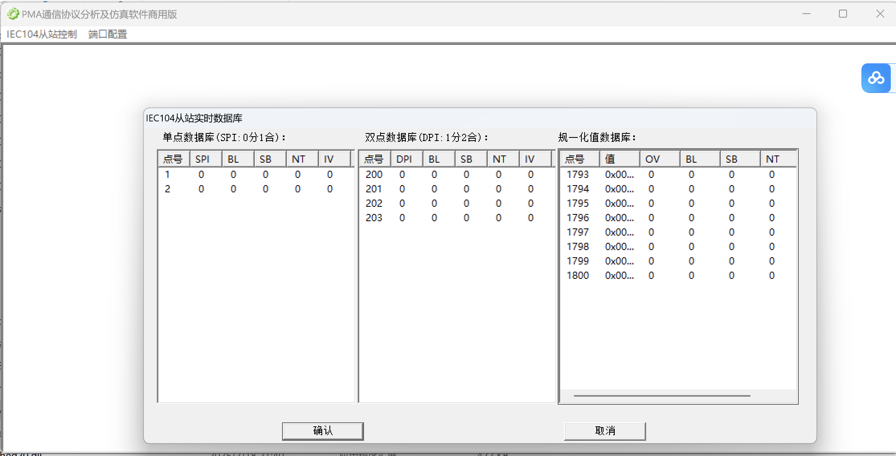

# 对于 macOS (使用Homebrew)
brew install lib60870

# 对于 Linux (Ubuntu/Debian)
sudo apt-get install lib60870-dev

# 对于其他Linux发行版，需要从源代码编译：
git clone https://github.com/mz-automation/lib60870
cd lib60870
mkdir build
cd build
cmake ..
make
sudo make install

# 安装依赖
https://iec104-python.readthedocs.io/latest/install.html

# server 可以用PMA 模拟

